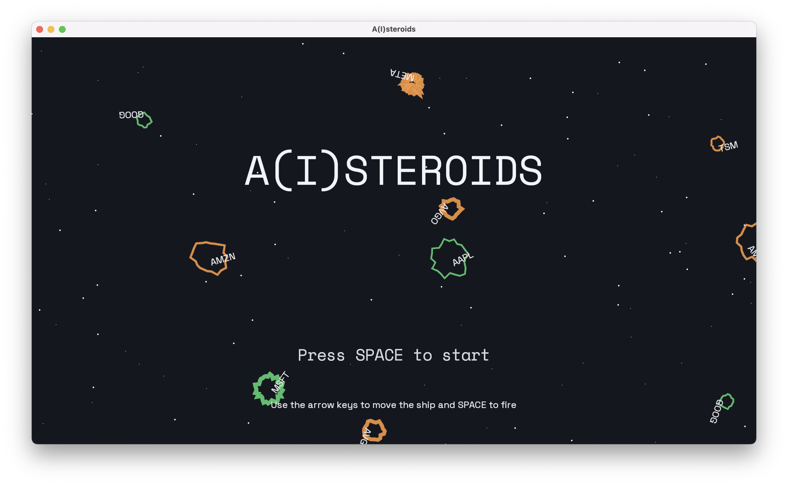
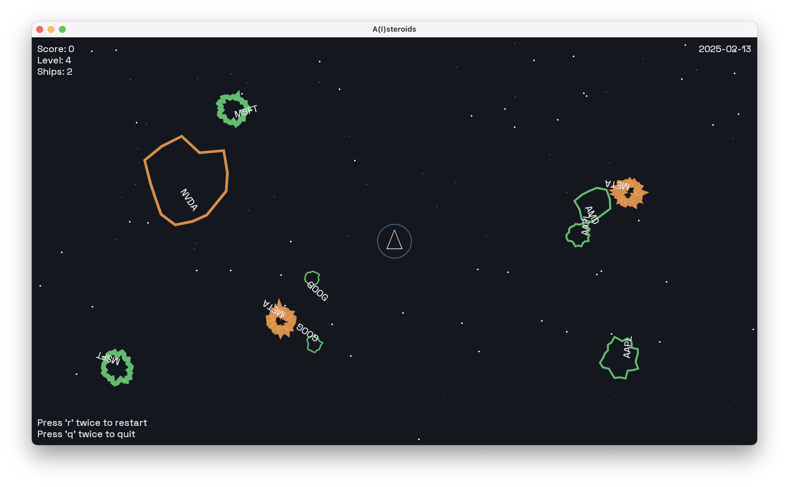

# A(I)steroids

A(I)steroids is an [Asteroids](<https://en.wikipedia.org/wiki/Asteroids_(video_game)>)
clone developed in the [Love2D](https://love2d.org/) framework. The classic
Asteroids game mechanics are used as a metaphor for the volatile and fragmented
nature of AI technology and markets.

Larger asteroids splitting into smaller ones mimics how AI technologies branch
into specialised applications. The player's struggle to navigate/defend through
chaos reflects our attempt to make sense of rapid AI delopments and the lack of
consistent or planned-ahead regulation.

Using stock prices to generate asteroids characteristics also creates an
interactive data visualition. Game mechanics are used to explore market
volatility through:

- asteroid size based on the stock's trading volume for the day
- asteroid colour reflects price change (last - open): green for gains, darker
  red for larger losses
- asteroid segments scale with the stock's last price
- asteroid line width matches daily price range (high - low)
- asteroid rotation speed tied to price change magnitude: clockwise for gains,
  counter-clockwise for losses
- asteroid speed correlates to daily stock volatility

## Data

The stock data was downloaded from the [Nasdaq](https://www.nasdaq.com/) website,
using the historical data from the past month, covering the period between
2025-02-07 and 2025-03-06. The data was combined into a single CSV file, and then
converted into a lua table using the `data/csv_to_lua.py` script. The stocks
included are:

- Amazon (AMZN)
- AMD (AMD)
- Apple (AAPL)
- Broadcom (AVGO)
- Google (GOOG)
- Meta (META)
- Microsoft (MSFT)
- NVIDIA (NVDA)
- Taiwan Semiconductor Manufacturing Company Ltd(TSM)

The conversion script requires the Python [pandas](https://pandas.pydata.org/)
library.

## Music

The game music was created through [Data Sonification](https://en.wikipedia.org/wiki/Data_sonification),
using [Sonic Pi](https://sonic-pi.net/). The same variables used
to generate the asteroids are used to generate the music. Notes are derived from
the stock volume, and synth effects are derived from the stock prices.

The script used to generate the music is `assets/music/csv_to_audio.rb`. The
script needs to be run inside Sonic Pi.

## Structure

- `src/`: Source code
  - `data/`: Data files
  - `entities/`: Entity components, e.g. player, asteroid, bullet
  - `systems/`: Systems components, e.g. collision detection
  - `utils/`: Utility components, e.g. colours
  - `states/`: Game state components, e.g. game state, game over
- `assets/`: Assets, e.g. audio, fonts, images
- `conf.lua`: Configuration
- `main.lua`: Entry point and game loop
- `README.md`: This file

## Running the game

To run the game, you need to have [Love2D](https://love2d.org/) installed, and
a copy of the game from the [releases](https://github.com/kingsdigitallab/aisteroids/releases).

## Credits

- `assets/sounds/laser.ogg` was converted to OGG format from the original by
  [bubaproducer](https://freesound.org/s/151013/) -- License: Attribution 4.0
- `assets/sounds/thrusters.ogg` was converted to OGG format from the original by
  [DJT4NN3R](https://freesound.org/s/347576/) -- License: Creative Commons 0

## References

- [LOVE](https://love2d.org/wiki/Main_Page)
- [Sheepolution - How to LÖVE - Table of Contents](https://sheepolution.com/learn/book/contents)
- [GitHub - Keyslam/LOVE-VSCode-Starter-Template: A minimalistically configured VSCode template for LOVE](https://github.com/Keyslam/LOVE-VSCode-Starter-Template/)
- [Data sonification - Wikipedia](https://en.wikipedia.org/wiki/Data_sonification)
- [Sonification](https://en.wikipedia.org/wiki/Sonification)
- [Telling data stories with music](https://datajournalism.com/read/longreads/data-sonification)
- [The Sound of Data (a gentle introduction to sonification for historians)](https://programminghistorian.org/en/lessons/sonification)
- [Sonic Pi: Basics](https://joeyreyes.dev/blog/sonic-pi/basics)

## TODO

- [ ] Expand welcome screen
- [ ] Improve game over screen
- [ ] Add a sound effect for the ship explosion
- [ ] Add a sound effect for the asteroid explosion
